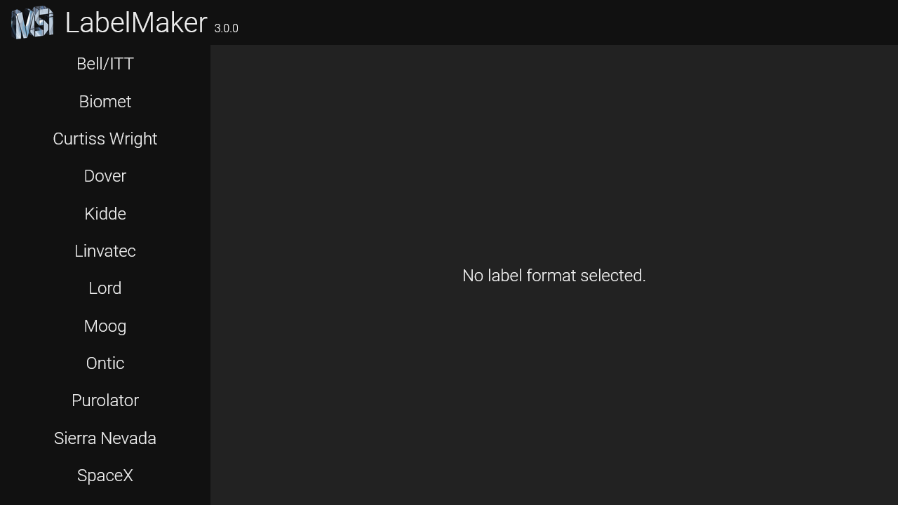
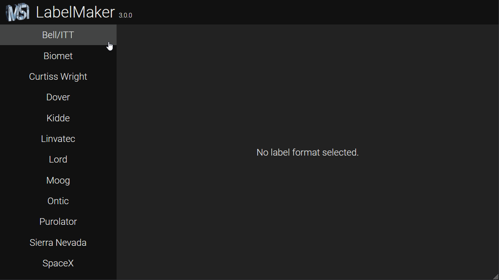
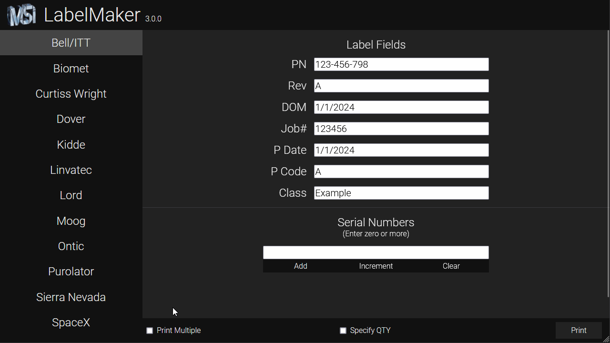

# LabelMaker 3.0

This is a full rewrite of the oldest Python project at MSI using our 2024 tech
stack. It is a web application instead of a standalone executable, which takes
both user and developer experience into account and makes future development far
easier.

## Usage Guide

### Getting Started

When you first open the program, the screen will look like this:

Select a format by hovering and clicking over the relevant option:

Now, you're free to enter the details of your labels:

### Serial Number Entry

Since version 2.0, many improvements have been made. For instance, you can now
enter many, many more serial numbers without any performance problems. As you
add more serial numbers, the display will scroll to the end automatically.

You can add serial numbers by selecting the input field, entering the first
number, then pressing **Enter**. You can quickly increment serial numbers by
pressing **Shift+Enter**, and if you have many numbers to increment, you can
press and hold **Shift+Enter** to reduce both time and effort.

You can remove individual serial numbers and edit them by double-clicking. Press
**Enter** to confirm your changes. To cancel editing, press **Escape** or
**Tab**, or simply press **Enter** without changing anything. You can clear all
serial numbers by clicking **Clear**, then confirming.

### Printing Options

You can print multiple of each label by checking **Print Multiple** at the
bottom of the screen, then specifying the amount per label. This is where you
select how many labels you want to print if you are not using serial numbers.

Checking **Specify QTY** will allow you to select a number _**n**_. When
checked, the text &quot;QTY: _**n**_&quot; will be added to the end of each
label. Be aware that, in the case of label formats contain the maximum number of
rows (limited by the size of your labels), this text will not appear on the
resulting label because it will be pushed out of bounds by the preceding fields.

**Important:** If you check **Print Multiple** and have any serial numbers
entered, the number of labels you select will be printed for each unique serial
number. This can lead to unintended printing of too many labels.

**Example: If you have five serial numbers and choose to print ten multiples,
you will print fifty labels.**

